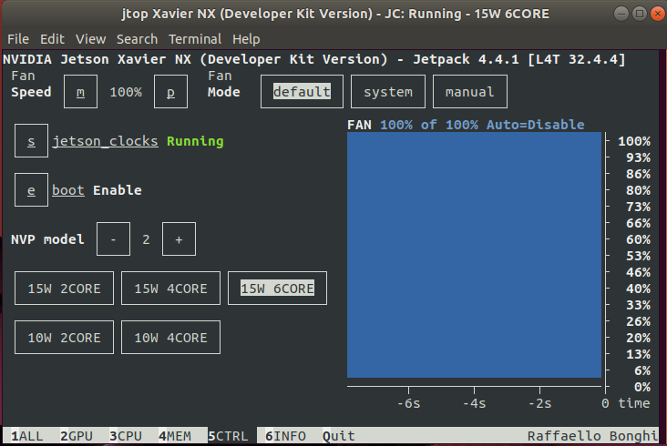

## 1. 烧录镜像文件:
登录nvidia官网，下载对应的Xavier NX的镜像image文件，ubuntu系统可以用balena-etcher-electron工具写入sd卡。

## 2. 安装系统:
将SD卡插入xvaier，连接键盘、鼠标、显示器（务必先连接上），供电自动启动，
大概20秒左右进入安装界面，选择英文，设置用户名密码，之后会自己安装并启动进入ubuntu系统。

## 3. 启动时风扇不转，芯片会发热，先应急启动风扇 （*重启会失效*）:
 进入终端，输入以下命令：

    sudo sh -c "echo 200 > /sys/devices/pwm-fan/target_pwm" 
## 4. 安装更新及pip3 source:   
    sudo apt-get update
    sudo apt-get upgrade
    sudo apt-get install python3-dev python3-pip libopenblas-base libopenmpi-dev libomp-dev
    pip3 install Cython

## 5. 安装jtop工具: 
    sudo -H pip3 install jetson-stats

## 6. 查看jetson运行状态：
    sudo jtop   
   会出现jetson xavier设备状态，在这里也可以进行一些设置,按5进入设置画面
+ 修改功率，开启6核，选择15W 6CORE
+ 设置开机自启动风扇，按s打开风扇,e设置开机启动，按m和p可以调节风速

   
## 7. 修改环境变量
    sudo vim ~/.bashrc
    export PATH=/usr/local/cuda-10.2/bin${PATH:+:${PATH}}
    export LD_LIBRARY_PATH=/usr/local/cuda-10.2/lib64${LD_LIBRARY_PATH:+:${LD_LIBRARY_PATH}}
    export CUDA_ROOT=/usr/local/cuda
    source ~/.bashrc
    nvcc -V    # 即可看到cuda版本
  
## 8. 安装pytorch，torchvision. 注意对应关系
*本次安装的是pytorch=1.8 torchvision=0.9.0*

下载地址：https://forums.developer.nvidia.com/t/pytorch-for-jetson-version-1-10-now-available/72048
   
找到对应的版本：
 
    wget https://nvidia.box.com/shared/static/p57jwntv436lfrd78inwl7iml6p13fzh.whl -O torch-1.8.0-cp36-cp36m-linux_aarch64.whl
    pip3 install Cython
    pip3 install torch-1.8.0-cp36-cp36m-linux_aarch64.whl

    sudo apt-get install libjpeg-dev zlib1g-dev libpython3-dev libavcodec-dev libavformat-dev libswscale-dev
    git clone --branch v0.9.0 https://github.com/pytorch/vision torchvision   
    cd torchvision
    export BUILD_VERSION=0.9.0  # where 0.x.0 is the torchvision version  
    python3 setup.py install --user

测试是否安装成功：

    python3
    import torch
    import torchvision
    # 如果有提示错误，基本上都是因为版本不匹配，例如： PIL.Image has no attribute "BILINEAR"
    查看pillow版本,卸载后降级：
    pip3 uninstall pillow
    pip3 install pillow==8.4.0
   
## 9. 安装opencv:

#### 1） 自带的opencv 是没有经过cuda编译的。
在 jtop 信息中，按6查看info,可以看到 opencv: 4.1.1 complied cuda : No

#### 2)  卸载自带的opencv: 
    sudo apt purge libopencv*
    sudo apt autoremove
    sudo apt update

#### 3) 安装依赖库：      
    sudo apt install -y build-essential checkinstall pkg-config yasm gfortran
    sudo apt update
    sudo apt install -y libgstreamer1.0-dev libgstreamer-plugins-base1.0-dev
    sudo apt install -y libpng-dev libtiff-dev libdc1394-22-dev libxine2-dev libv4l-dev
    sudo apt install -y libgstreamer1.0-dev libgstreamer-plugins-base1.0-dev libgtk2.0-dev libtbb-dev libatlas-base-dev libfaac-dev libmp3lame-dev libtheora-dev libvorbis-dev libxvidcore-dev libopencore-amrnb-dev libopencore-amrwb-dev x264 v4l-utils
    sudo add-apt-repository "deb http://security.ubuntu.com/ubuntu xenial-security main"
    sudo apt-get update
    sudo apt-get install libjasper1 libjasper-dev

#### 4）下载opencv及对应的opencv-contrib文件，并解压。将opencv-4.5.5 及 opencv_contribute-4.5.5放在同一文件夹下
    cd opencv-4.5.5
    mkdir build
    cd build

    cmake \
    -DCMAKE_BUILD_TYPE=Release \
    -DCMAKE_INSTALL_PREFIX=/usr/local \
    -DOPENCV_ENABLE_NONFREE=1 \
    -DBUILD_opencv_python2=1 \
    -DBUILD_opencv_python3=1 \
    -DWITH_FFMPEG=1 \
    -DCUDA_TOOLKIT_ROOT_DIR=/usr/local/cuda \
    -DCUDA_ARCH_BIN=7.2 \
    -DCUDA_ARCH_PTX=7.2 \
    -DWITH_CUDA=1 \
    -DENABLE_FAST_MATH=1 \
    -DCUDA_FAST_MATH=1 \
    -DWITH_CUBLAS=1 \
    -DOPENCV_GENERATE_PKGCONFIG=1 \
    -DOPENCV_EXTRA_MODULES_PATH=../../opencv_contrib-4.5.5/modules \
    .. 

#### 5) make -j6  (*大约2-3小时*）

#### 6) sudo make install （*等待*）

#### 7) sudo ldconfig

#### 8) jtop中查看，可以看到opencv 是经过cuda编译的。(*还没完，在使用的时候可能会报错*）

#### 9) 此时在python3中import cv2 可能会提示没有module，拷贝so文件到dist-packages/
    sudo cp /usr/local/lib/python3.6/site-packages/cv2/python-3.6/cv2.cpython-36-arm-linux-gnueabihf.so /usr/lib/python3.6/dist-packages/
